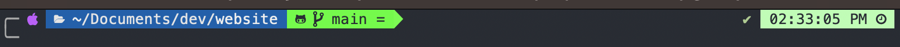

## Intro

For so many times, I was using my default terminal without changing anything, not even the default theme and background you can have in settings. Then I started wanting to have a very nice one but found everything so difficult that I gave up. Finally one day I decided that I would do it and will manage to end up with a terminal that I like and enjoy.

I‘ll guide you through every few steps I took using only 2 tools so you can also find themes, colors, fonts or whatever that you like.

## Tools

1. Fig

First of all, let's talk about [Fig](https://fig.io/), which I use for the autocomplete feature in the terminal. Fig has so many other features, but I'll keep it simple for this article, and only focus on the autocomplete default feature that you can also customize. Download it and follow the instructions.

2. Powerlevel10K

The second and last tool is [Powerlevel10k](https://github.com/romkatv/powerlevel10k). This tool lets you give a personalized look to your terminal. Install it following the instructions and you will be prompted to choose between so many possibilities.

Then, it will create a .p10k.zsh file where you'll be able to customize even more, with text color, background color...

A very useful tip is to type directly in your terminal:

```
 for i in {0..255}; do print -Pn "%K{$i} %k%F{$i}${(l:3::0:)i}%f " ${${(M)$((i%6)):#3}:+$'\n'}; done
```

This command will open a color palette with all the needed color codes to replace the default ones.

## Conclusion

I know it's a short article but it's a simple and useful one. Spending a little bit of time with it and you will get a fantastic terminal like the screenshot below with autocomplete (all that you need). Happy coding!!


