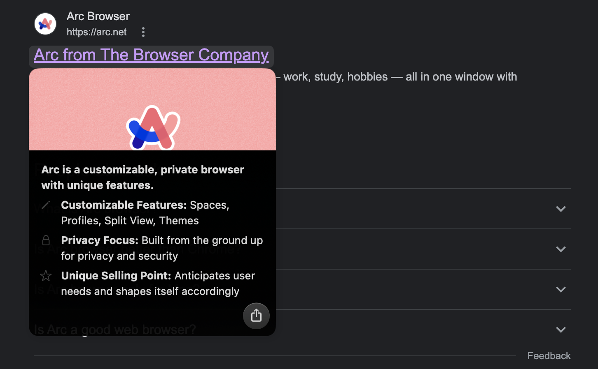
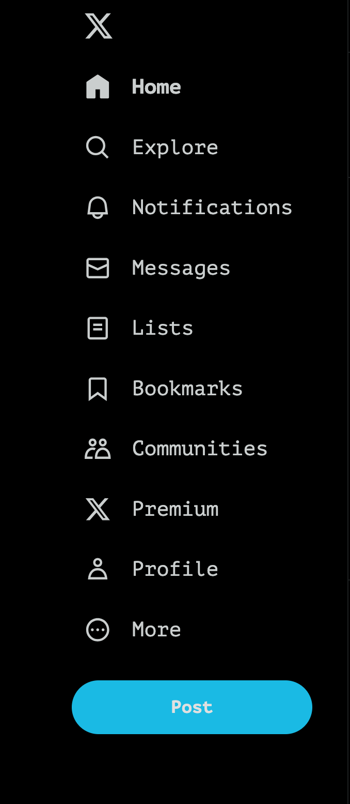
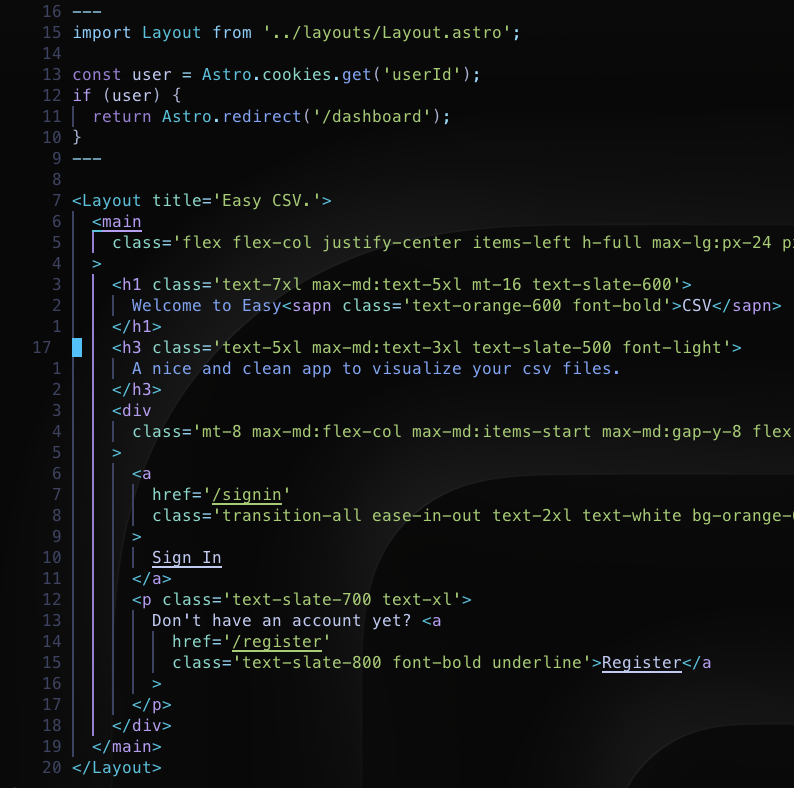

## INTRO

Being a developer is existing in so much domains. You're always learning new things and it's like a never ended process. Always new languages, frameworks, tools... 
In this article I want to share an important point for me, that I'm starting to focus on, more and more. This is my developer environment. What I mean by that? The tools, shortcuts, IDE, that I use and that make my developer experience much more efficient and also more exciting.

## STARTING POINT

First of all, you have to know that I'm using a MacBook pro with a second screen. Of course you'll probably find some differences or even useless informations depending on what operating system you're using.

## ACCESSORIES

As I said, I'm using a MacBook pro, combined with a Logitech MX Keys Advanced keyboard. Probably the best keyboard I ever tried. The touch with the keys is amazing, and a very good autonomy. I also have an Apple mouse. On this matter I think there are better mouses. Can be very useful as you can interact like with the touchpad, swipping one or two fingers (horizontally or vertically) to perform different motions. The thing that I hate the most (and I'm probably not the only one) is the fact that you can't use the mouse when it's charging as the plug is under it. WHY?????. Finally my second sreen is a cheap samsung one not very good quality but allows me to see different windows at once.

## SOFTWARES

Now let's jump into the heart of the matter. There are so many different softwares and tools available on the market today that it's so easy to get lost. That's why I want to share what I've found best fit for me after trying so many different things.

### Browser

One of the most important part in our domain is the browser. Google Chrome has been my browser for so many time, that I've never thought I will find a better product. I was wrong!!! 
[Arc Browser](https://arc.net/) is just what I needed and is definitively the next generation browser. First of all it keeps all your Chrome bookmarks and extensions. It might be obvious, but I appreciated to not have to set up everything again. I'm not gonna go over all the features, but they always come with updates that astonished me. For example, they have AI integrated, so when you hover over a link you have a little description on what the link is about:

Pressing CMD + F lets you ask anything to the AI, as for example "Give me a resume og this page". You have workspace with different pinned tabs (bookmarks) or windows. I have my pinned tabs for personal things like social media, emails... and a work one where i put documentations, hosting providers, my projects... The final feature I want to mention is that every webpages is customizable. So you can change the colors and the fonts. Here is my X config:

### App manager

One of the best product on the market today, in my opinion, is [Raycast](https://www.raycast.com/) For the moment it's only available on Mac, but has interest in moving to Windows too. It's a spotlight substitute and you can't imagine what this app is able to do. First of all I use it to open all the apps that I need. Then the possibilities are endless. With customizable hotkeys, I can search for files in specific folder, create a query parameter for specific app (browser or finder), search for open tabs in my browser, manage my spotify music, search for documentation, clipboard (integrated), schedule manager, windows management, search everything on github, manage my repos... and so on and so on. It's impossible to list of the possibilities it offers. They always add new extensions and everybody is invited to collaborate on the project. I don't have to touch my mouse and can just navigate in my computer with ease and quickness. This is the type of softwares that when you use them you can't imagine working without it.

### IDE

I'm a VsCode lover but wanted to try something different after facing a lot of issues with git, thinking that was coming from VsCode. So I've tried [Neovim](https://neovim.io/doc/) I admit that it can take a long time to make it up and running as you want and to be familiar with the shortcuts, but the experience is so exciting. If you want to start without any knowledge I highly recommend to use the [Kickstart](https://github.com/nvim-lua/kickstart.nvim) which allows you to have very useful config to start with. From there you can learn how it works and add new things or modify existing ones. It's written in [Lua](https://www.lua.org/) which is not a difficult language for the configuration, quiet easy to understand the syntax. Anyway the community and the documentation around Vim are huge, so you'll always find resources and help when needed. A nice feature as example is the possibility to jump directly to any specific line. In the screenshot below where my cursor is I have the line number and on top and above the line distance count, so I can press '17' and J (moving down) and I jump directly to the line where my 
 tag ends.

One weird thing that I've notice using it, is that you have to quit the IDE to go back to your terminal. So on top of that I'm using [Tmux](https://github.com/tmux/tmux/wiki/Getting-Started) which is a terminal multiplexer. You manage your sessions which can contain several windows. So with easy shortcuts (that you can modify, to be for example only one key), you can switch so quickly between your code editor and your terminal or between different sessions or windows. For example you can have a session for backend and one for frontend.
Finally on top of that you can use [FZF](https://github.com/junegunn/fzf) which is a fuzzy finder. It means that from your terminal you type fzf + enter and a pop window appears where you can search for files, command history, processes, hostnames, bookmarks, git commits, etc...  with a preview on the right side.
To give you an example, this is what I perform when opening my computer:
1. Option + Space to open raycast
2. Choose my terminal (next section) and Enter
3. I cd into the folder of the project I'm working on and type "tmux new" it opens a new session where I can open different window.
4. Perform "nvim ." to open the editor and press Control - B and then C to open a new window. It means I have a window with my terminal ready to run the code and another window with my code. Pressing Control - B and then 0 or 1 I switch between windows instantly.
5. I do Option + Space again (raycast) type Spotify and choose "My library", to finally select the music that I want and press enter.

I wasn't really concern about not using the mouse before, but it has radically changed my effenciency to work. Five little steps, no use of the mouse and 1 - 2 minutes after the computer is on, I have everything that I need ready to work, with music in my ears.

### Terminal

I was using my Mac default terminal for a long time and wanted to use it with Neovim, but the color scheme wasn't correct creating weird visual behavior. I've used in the past [Warp](https://www.warp.dev/) and was working perfectly with Neovim, so I've adopted it. Here again an amazing next generation software that really makes your life easier. You can have different windows, panes, AI integrated, commands snippets creation, commands history, auto-completion, search commands and a cursor as a text editor!!! WOW!!!! Normally Mac only, but there is a waitlist for Linux and Windows.

### Notes taking

Taking notes can be crucial when you learn something new, or you have a busy agenda, or reading an article... For that I use [Obsidian](https://obsidian.md/) which is amazing for that. Its links to other notes and its tag system are so convenient that is easy and enjoyable to take notes. This app is full of plugins to fit your needs. You can add calendar, create note templates, add an excalidraw note, customize functionalities and so much more. I'm not an expert with this app but for my needs it fits perfectly. I take notes link them if needed so I can jump to a definition or another note. As it is a markdown syntax it's easy to write and layout my articles, like this one. Then I copy paste in a md file to publish it (in my code base or in hashnode).

## CONCLUSION

Learning to be a developer is a hard and long journey. Fortunately we have a lot of programs, softwares, tools that can make our lives easier. It can be overwhelming to have to learn new things and change our habits, but sometimes it worths it. Taking the time to create my environment has been beneficial, and will last in time as I discover new features and get used to it more and more. This will increase even more my productivity earning precious time during my journey (as a father of three I assure you that my free time is rare and I need to be efficient quickly). I'm not here to convince you to follow exactly my set up, but it's just to make you thing about creating an environement that fits your need, will always be a win. Take the time needed to adapt and see how the things work for you and make the decision to improve your day to day.
