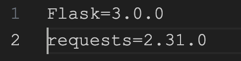

## Introduction

3 years ago I started learning Python, and what made me stop learning it, were the issues I had with virtual environment, Python interpreter, path errors and a lot of other problems I wasn't able to understand as I was starting learning web development. In this article, we will have a look at what all these words mean, how they work and especially the importance of setting up a virtual environment to make your developer experience enjoyable and simpler.

## The Python interpreter

At the heart of the Python environment is the Python interpreter. It is responsible for executing Python code line by line. The interpreter reads the code, converts it into bytecode, and then executes the bytecode. This process allows Python to be an interpreted language, enabling developers to write and run code more quickly.
You can have different interpreters on your system as Python version and if you want to learn more about it and how to manage it, please check out this [blog](https://www.baeldung.com/linux/python-multiple-versions)

## Package Management with Pip

Python has a powerful package management system called pip. Pip allows you to easily install, upgrade, and manage third-party libraries and packages for your Python projects. When you install a package using pip, it is downloaded from the Python Package Index (PyPI) and installed into your Python environment.

## Virtual Environments

The best way to code and not be confused about different Python versions, Python interpreters, and package versions, is to set a Virtual environment.

Virtual environments are an essential part of the Python environment, especially when working on complex projects with multiple dependencies. A virtual environment is an isolated environment that allows you to have different versions of Python and installed packages for each project. It prevents conflicts between different projects by creating a separate environment for each one.

When you activate a virtual environment, it modifies the system's PATH variable to ensure that the Python interpreter and packages installed within that environment take precedence over the global ones. This way, you can have different versions of packages and Python itself without affecting other projects or the system as a whole.

An important point to understand is that when you install a package globally in your system it downloads the latest version each time, overriding the previous version installed (if you already had one installed). For a better understanding let's take an example:
You create a project and install "Pandas" for example. You work on it and everything goes well. Later on, you create another project with pandas which has new functionalities and you want to try it. So you install again pandas and you enjoy the new functionalities. The problem is when you go back to your first pandas project maybe it will not work anymore as expected and the pandas version you have on your system, is the new one so your code is not working as it should be over the years/months/projects. This where a virtual environment takes all its sense.

## Create your virtual environment

All these steps have to be done inside your project directory

1. To create a virtual environment, you use the venv module, which is included in Python 3.3 and later. You can create a virtual environment by running the following command in your terminal:

```
python -m venv myenv
```

This command will create a directory named myenv (you can choose any name you like) that contains a separate Python interpreter and a copy of the Python standard library.

2. After creating the virtual environment, you need to activate it. On Windows, you activate it like this:

```
myenv\Scripts\activate
```

On macOS and Linux, you activate it like this:

```
source myenv/bin/activate
```

When the virtual environment is activated, your command prompt will change to indicate the active environment, like this:

```
(myenv) user:~/project_directory$
```

For me instead of my normal prompt without virtual environment:


I'll have:


Now, any Python packages you install or commands you run will be isolated to this virtual environment.
Inside the activated virtual environment, you can use pip, the Python package manager, to install packages. For example:

```
(myenv) user:~/project_directory$ pip install package_name
```

This will install the package in the virtual environment, and it won't affect the global Python environment or other virtual environments you may have. Every project will have its one environment and set up so you'll never encounter any conflicts or global issues on every projects.

When you're done working on your project and want to leave the virtual environment, you can deactivate it by running:

```
deactivate
```

3. Requirements.txt file
   A good practice to have is to create a file called requirements.txt in your root directory, where you put all your packages with their respective version. So when someone clone your code, for example, it will install the correct version for the code to work properly on other virtual environments.
   In this file just write:
   
   Once your file created you can run the following command to install those packages:
   ```
   pip install -r requirements.txt
   ```
   Maybe you notice that in my example I use pip and you have probably seen, if you're on Mac pip3. When you're in a virtual environment the command pip will work as a pip3 so no need to worry about it. Pip also works seamlessly with virtual environments. When you activate a virtual environment, pip automatically knows to install packages into that specific environment, keeping them separate from other projects. This makes it easier to manage dependencies and ensures that your project remains isolated from others.

## Conclusion

Understanding how the Python environment works is crucial for any Python developer. The Python interpreter, virtual environments, and the package management system all play a significant role in creating a smooth and efficient development experience. By leveraging these tools effectively, you can build and deploy Python applications with confidence and ease.

So next time you are working on a Python project, take advantage of virtual environments and pip to keep your projects organized and maintainable. Happy coding!
