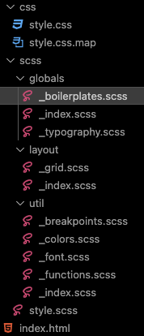

### Intro

CSS, What is CSS? If HTML is the skeleton of the human body, CSS is the skin, the color of the eyes, the haircut... You can't pretend to build websites or apps without knowing CSS. But there are many different ways to add styles to your project (writing vanilla CSS, using SASS which is an extension of CSS, or using frameworks like Tailwindcss). You can compile your CSS with Postcss (for example in your webpack project), or you can use libraries like Bootstrap, ChakraUi, Mantine etc... In this article, we're going to talk about using vanilla CSS, SASS and Tailwindcss. Why only those 3? Because there are my most used ones. Keep in mind that you'll have to start anyway with CSS all the other options will bring you more flexibility or options but will work if you understand CSS.

## CSS

First of all, if you are a beginner with CSS and want to learn it, here are some links to great ressources:

- [DesignCourse](https://www.youtube.com/watch?v=Kl3nOXQjVnQ&t=1696s)
- [Brad Taversy](https://www.youtube.com/watch?v=yfoY53QXEnI&t=10s)
- [MDN Website](https://developer.mozilla.org/en-US/docs/Web/CSS)
- [W3Schools](https://www.w3schools.com/cssref/index.php)

What I like about CSS and I also strongly recommend to you, is the possibility to name your classes and/or your ids with a very clear and descriptive name. You can’t be lost if you clearly describe what the class or the id is for:


Here we have a very clear description of what these elements are for. It becomes easier when you are in your CSS files to style them.

### How do I start my CSS files ?

Like in every language or framework or tool, you have some conventions or/and best practices, that help you, to learn and get used to applying, sharing your work or understanding the work from other developers. It doesn’t mean that THIS IS the way to do it, but it’s the one used by convention as I said, that you’ll see a lot in different articles or tutorials. For example I like to start my CSS file like that:

```css
@import url('https://fonts.googleapis.com/css2?family=Chivo:wght@300;400;600;700&display=swap');

* {
  margin: 0;
  padding: 0;
  box-sizing: border-box;
}
```

Note that the ‘@import’ must always be at the top of the file. Here I use it to import my font from [Google Fonts](https://fonts.google.com). Then I select all the elements and get rid of the margin and the padding, so I can apply them myself without any default value from the browser (even without specifying the margin, the browser always have a small default one). Finally I put the box-sizing to border-box, so my width and height will include any borders or padding of an element, instead of adding them.

### Variables

You can use variables so you don’t have to copy the same properties over and over, and when you want to change a color, for example, you only have to change it once:

```css
:root {
  --primary-color: hsl(140, 55%, 60%);
}

button {
  background-color: var(--primary-color);
}
```

### Animations/Effects

CSS is very powerful and maybe sometimes underrated. For example, with css, you can create animations, effects, and style almost anything that you want. You will be amazed to see how [Kevin Powell](https://www.youtube.com/@KevinPowell/search?query=animations) can animate everything that he wants only with CSS. Most of the times you don’t even need Javascript for your animation, few lines of CSS can be enough.

```css
.button {
  animation: fade 0.9s ease-in-out;
}

@keyframes fade {
  from {
    opacity: 0;
  }
  to {
    opacity: 1;
  }
}
```

In this example the button will start at 0 opacity and fade in (during 0.9s) to opacity 1.

But you can also set it up like this:

```css
.button {
  animation: fade 0.9s ease-in-out;
}

@keyframes fade {
  0% {
    opacity: 0;
  }
  50% {
    opacity: 0.5;
  }
  100% {
    opacity: 1;
  }
}
```

For the effects, it’s the same thing you can almost do whatever you want. Target your inputs or links as follow and add styles for a better user experience:

- input:hover
- input:focus
- link:active or button:active

You can animate borders, svg paths, scrolls, pages, blocks of elements, images, box shadows, opacity… You can scale, rotate, transform, move (left, right, up, down), use blending modes…

And the most important thing is that CSS is responsible of the responsiveness of your projects using the @media tag:

```css
@media screen(min-width: 1024px) {
  h1 {
    font-size: 4rem;
  }
}
```

Finally 2 features that I advice you to keep in mind are the calc() method and the flex-grow property. Most of the time you will have a header in your project, and you want your main section to take all the available space without having to scroll (100vh). In this case you have you have these 2 options:

- Using calc() method:

```css
header {
  height: 160px;
}

main {
  height: calc(100vh - 160px);
}
```

In this situation I define always a height for my header so my main, with the calc() method, will have the height of a 100vh(all the window height), but subtracting the header, and so, no scroll bar will appear. If you don’t do it the size of your page will be 100vh + 160px of the header.

- Using flex-grow property:

```css
.container {
	display: flex;
	flex-direction: column:
	height: 100vh;
}

header {
	height: 160px;
}

main {
	flex-grow: 1;
}
```

In this case, I added a container that wrapped the header and the main with a display set to “flex” and “flex-column”. So, it doesn’t matter the size of the header, the main tag set to “flex-grow: 1” will take automatically the available space that is available to fill the full window.

### Conclusion

My conclusion will be like an advise. Go deep into CSS and all of its possibilities, and take the time to discover and learn what it’s capable of. I don’t say that you have to know everything because it’s impossible, but be curious and just be aware of what CSS offers you. You have a ton of resources on the web to find all the informaiton needed. More you’re gonna know CSS and more you’re gonna enjoy using other CSS tools or frameworks, to make your website or apps unique and with an amazing user experience.

## SASS

SASS is CSS version 2.0 or as it’s said on their [website](https://sass-lang.com/) it’s CSS with superpowers. At first glance it looks the same, I mean you can write full vanilla css in a sass file without any problem. The difference is that sass compile your css before being able to apply it. You have different ways to compile your sass file, for development I simply use the VsCode extension “Live Sass Compiler”. If you use frameworks, check out their respective documentation on how to implement Sass.

I like to use Sass when I have designed a project first. It helps you prepare your Css in advance and keep it well-organized before even jumping to the code. It’s a bit of boilerplate work but when you have it set up your styling will go much faster. It will also give you an easy way to share design within and across projects.



This is an exemple of what the Sass folder structure looks like. You can be scared seing that but, let’s explain it. First you create a style.scss file, and when it’s compile (following the different options to compile) your output (in this case the output i’ve choosen from the VsCode extension) will be in a folder called css and the file will be style.css with a map file. The map file is very useful and I really recommend it as it tells you in which scss file you have an error. The style.css is the one you link in your html file (not the scss one).

I like to separate my different styles with the categories of above:

- “globals”: some generics styles like the \_boilerplate one (in order to export and import your files you have to write them with the underscore '\_'):

```css
@use '../util' as u;

*,
*::after,
*::before {
  margin: 0;
  padding: 0;
  box-sizing: border-box;
}

body {
  background-color: u.$bg-color;
  font-family: u.$font;
}
```

So here I can import everything that I want with @use and can call it as I want “as u”.

- “layouts”: here you can define your generic styles for flex or in this exmple grid:

```css
@use '../util' as u;

.grid {
  display: grid;
  grid-template-columns: 1fr;
  grid-template-rows: auto auto;
  gap: u.rem(40);
  width: min(100%, u.rem(1000));
  margin-inline: auto;
}
```

- “util”: used to put functions, colors, font styles, breakpoints…:

```css
@use 'functions' as f;

// Create SASS map
// Breakpoints: 700px, 900px, 1440px

$breakpoints-up: (
  'medium': f.em(700),
  'large': f.em(900),
  'xlarge': f.em(1440),
);

// Create Mixin. Mixins allow you to define styles that can be re-used throughout your stylesheet
@mixin breakpoint-up($size) {
  @media (min-width: map-get($breakpoints-up, $size)) {
    @content;
  }
}

// breakpoints: 699.98px, 899.98px, 1439,98px
$breakpoints-down: (
  'small': f.em(699.98),
  'medium': f.em(899.98),
  'large': f.em(1439.98),
);
```

Here I create breakpoints functions so I can use them in all my shtylesheets. You will see what “functions” is in an example below. So from there I can re-use my breakpoints in my “\_typography” file:

```css
@use '../util';

p {
  @include util.breakpoint-up(medium) {
    font-size: util.rem(20);
  }
}
```

Another very important part, is to define a function that will convert pixels into rem or em units. But why? A lot of people are concerned with some visual disease and in order to see correctly on screens they bump the default font size up or down (not zoom).


They literally change it from the browser setting. If your units are with pixels they won’t be affected by this change (for example if your font-size is 16px, it will remain at a fixed 16px even the default browser font-size has changed). That’s why (it’s my opinion) you must define your sizes with rem or em units (also in CSS or any other frameworks) for these people to have a correct scale of all the elements when they bump it up or down. In Sass you have built-in modules to make things easier and create useful funcitons:

```css
// In util/_functions.scss
// Here I import the 'math' module
@use 'sass:math';

@function rem($pixel) {
  // If $pixel has no unit, Divide $pixel by 16 to return rems
  @if math.is-unitless($pixel) {
    @return math.div($pixel, 16) + rem;
  } @else {
    // Else, throw error
    @error 'value should be without unit, only numbers';
  }
}
```

Here we can see that I don’t have to specify any units, I just put the pixel value and it will turn it into rem units. If I make a mistake I will have an error and with the .map file, I know exactly where the error is. Now to use it, I add @forward in an index.scss (in the same folder) and I can import it anywhere else using @use:

```css
// In util/_index.scss
@forward 'functions';

// In globals/_typography.scss
@use '../util';

font-size: util.rem(18);
```

The last thing I want to show is nesting. Very simple instead of using:

```css
nav ul {
  margin: 0;
  padding: 0;
  list-style: none;
}
nav li {
  display: inline-block;
}
```

I can simply do:

```css
nav {
  ul {
    margin: 0;
    padding: 0;
    list-style: none;
  }

  li {
    display: inline-block;
  }
}
```

These are some few examples of a huge amount of possibilities that Sass offers you. If you want to learn Sass I highly recommend 2 Youtube Channels:

- [Kevin Powell](https://www.youtube.com/@KevinPowell)
- [Coder Coder\*](https://www.youtube.com/@TheCoderCoder)

\*I took example from her amazing tutorials to write this part of the article.

### Conclusion

Sass is an amazing and very powerful Css extension that prepares everything you need before starting to code a single HTML line. What I like about using this extension it’s when I write HTML I can already see all the styles displayed correctly and responsive. Sass can be very useful, for example, if you working with a designer, and little by little you can prepare the styles for the project (get all sizes of the buttons, the headings, the different breakpoints, the displays, the fonts, the colors…), you don’t have to wait the design to be finished to start coding, you’ll have a well-organized folder and style structure.

## Tailwindcss

Now let’s talk about my favorite one: Tailwindcss. To install it follow [These instructions](https://tailwindcss.com/docs/installation)

Tailwindcss is an amazing css framework, that makes your developer experience faster and easier. We’re gonna talk about 4 different topics:

- Syntax
- Tips and tricks (including VsCode extensions)
- The dark mode
- tailwindcss/typography plugin

### Syntax

Tailwindcss works with classes that you have to add to your HTML tags. The classes are named to understand easily the CSS property. For example

```css
align-items: center;
```

becomes:

```css
items-center
```

All these different classes only have to be separated by a space:

```css
class='font-bold text-white py-4 align-center'
```

In this example my font is bold, my text is color white, the padding on the y-axis is 16px (1 unit in tailwind is 4px), and my text is aligned to the center.

It can be difficult to get used to it at the beginning, but after a few tries you understand that you can go directly to the value that you want, quickly, because no CSS syntax, and without changing files, it’s directly on the HTML tag you want to target.

You’ll find a lot of built-in classes, but you can still use arbitrary values and it works like that:

```css
class='text-[16px] max-w-[90%] p-[2rem]'
```

### Tips and tricks

As you can imagine an HTML element can contain a lot of classes and sometimes it becomes very difficult to read. Thanks to a wonderful VsCode extension you can hide the classes for better readability. It is called [Inline fold](https://marketplace.visualstudio.com/items?itemName=moalamri.inline-fold). Download it and start using it.

If you use Tailwind you must also use the the [Tailwind IntelliSense Extension](https://marketplace.visualstudio.com/items?itemName=bradlc.vscode-tailwindcss), to help you auto-complete your class when start typing.

In Tailwind, you can customize everything you want. For example, the screen size, you can define your breakpoints. I personally like to change the medium breakpoint (md). It can be useful if you work with a designer, and who has slightly different breakpoints than the Tailwind default configuration, which you can find [here](https://tailwindcss.com/docs/responsive-design#using-custom-breakpoints).

To change the configuration go to the tailwind.config.js file in your project and add the screens object with the values that you want:

```css
/** @type {import('tailwindcss').Config} */
module.exports = {
  content: [
    './pages/**/*.{js,ts,jsx,tsx}',
    './components/**/*.{js,ts,jsx,tsx}',
  ],
  theme: {
    extend: {},
    screens: {
      sm: '640px',
      md: '803px',
      lg: '1024px',
      xl: '1280px',
    },
  },
  plugins: [],
};
```

Another useful tip is when you want to combine a class with the conditional statement and built-in class in the same tag. I’m using it every time when set up dark mode for example, which I’m gonna talk about later:

```css
className={`h-full ${isDarkMode === true ? 'dark' : ''}`}
```

Here my tag has a height of 100% but also a conditional statement that if isDarkMode is set to true it will have the class of dark, if set to false no class will be assigned.

My final tip will be that you can specify opacity when defining colors in Tailwind:

```css
class='bg-slate-800/80'
```

In this example i’m using a built-in color but I’m adding an opacity of 80%.

### Dark Mode

As you’ve already probably seen almost everywhere the possibility to toggle a dark or light theme has become very popular, to give a better user experience. It can be a bit tricky to set it up with CSS, that’s why Tailwind allows us to make it so easy. And with the conditional statement you’ve just seen above, I'm pretty sure you’re gonna use it almost every time (can be very nice for your clients, to tell them that you can add this feature if they haven’t asked you already).

You have different ways to set it up:

Adding directly the class “dark” variant in your tags and will automatically toggle the dark mode following the system preference theme:

```css
class='dark:bg-slate-900'
```

Toggle it manually. That’s the one I use so the client can decide to toggle it itself, when he wants. For that you just have to add the following line in your tailwind.config.js:

```css
module.exports = {
  darkmode: 'class', // ...
;
}
```

Then define the variant as the first method:

```css
class='bg-blue-300 dark:bg-slate-800'
```

How easy it is? And this is what I love about tailwind, is the set of amazing features or different syntax that make your developer experience so enjoyable.

### Tailwindcss/typography plugin

And now to finish this article I would like to talk about a fantastic Tailwind plugin for those who are working on markdown files. When I start using markdown files, my question was, how do I style them? Must it be always black text color on a white background? So again, tailwind makes it so easy with [tailwindcss/typography plugin](https://tailwindcss.com/docs/typography-plugin).

Let’s set it up:

```css
npm install -D @tailwindcss/typography
```

Then you have to add it to your tailwind.config.js file:

```css
module.exports = {
  theme: {
    // ...
  },
  plugins: [
    require('@tailwindcss/typography'),
    // ...
  ],
}
```

Finally just add the “prose” class to your tag that will display your mardown file. This is the example I’ve used for this blog using Astro:

```css
<article
      class='prose prose-base md:prose-lg lg:prose-xl prose-a:text-cyan-500
prose-headings:text-white prose-p:text-gray-300 hover:prose-a:text-cyan-600
prose-strong:bg-cyan-100 prose-strong:text-gray-900 my-24
prose-pre:bg-white max-w-none h-full'
    >
      <slot />
    </article>
```

In the same way as the tailwind syntax, you can make your article responsive with the “md:prose-lg”, which means that on a larger screen, my font size will be large.

If you want to learn Tailwind, I strongly recommend the [FreeCodeCamp tutorial by Guillaume Duhan](https://www.youtube.com/watch?v=ft30zcMlFao&t=21s)

### Conclusion

Tailwind is by far (it’s of course my opinion, with my needs and my personal preference), the most powerful tool to style your projects. Easy to use, fully customizable, well documented and a huge community. It also has all the VsCode extensions or plugins to let you adapt what you need and make your work faster and easier.

## Outro

Styling is a huge world on its own. The possibilities are tremendous, let your imagination talk, and there will be a solution to make it real on your projects. There is no better tool or framework, it only depends on what you like and what you need. If your method makes you turn projects to life that’s fine, don’t feel like you have to use a framework if you just love CSS. The exact thing is that you must know CSS before using a framework of any kind, as I said earlier in this article, taking the time to read a lot about CSS, through documentation or articles, is the only way to reach the goal when the user experience is enjoyable. You can be a very good programmer if your project doesn’t look good, the client won’t be satisfied and the users won’t enjoy it. I conclude with a last advice, simple things are most of the time the better ones. Don’t try to put all the CSS features in one project, be subtle and keep it cleaned-looked.
