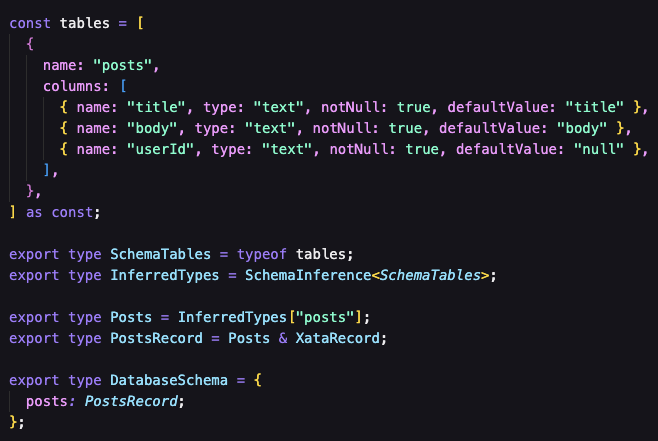
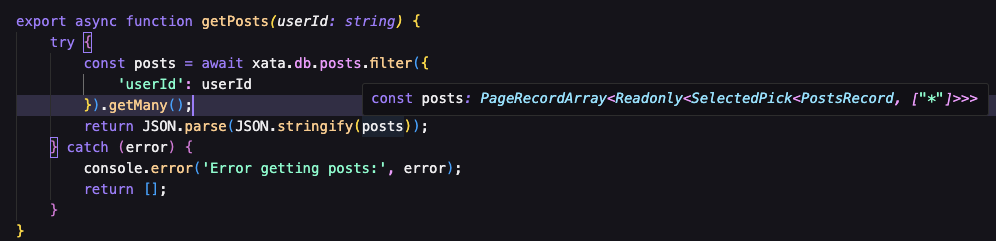
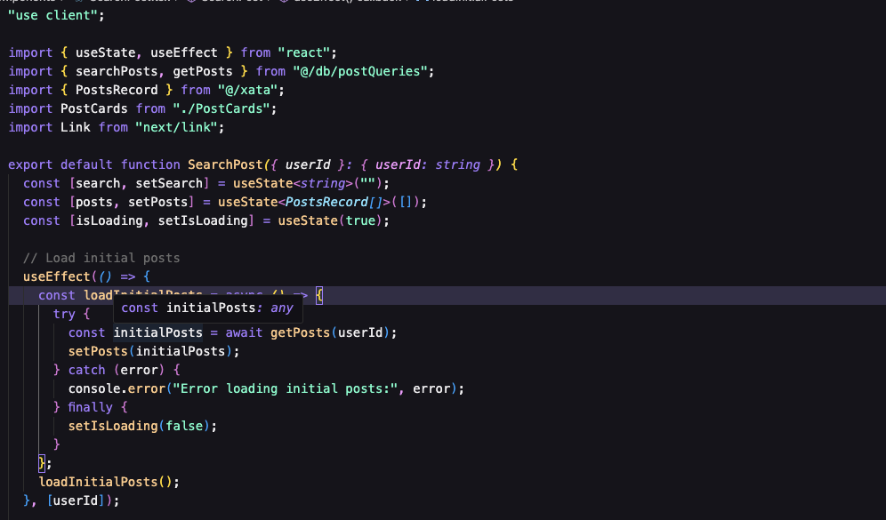
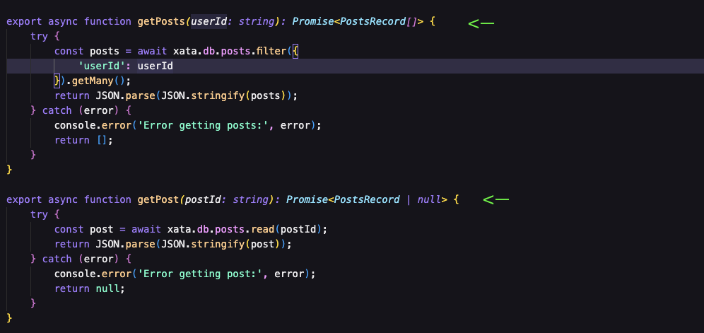
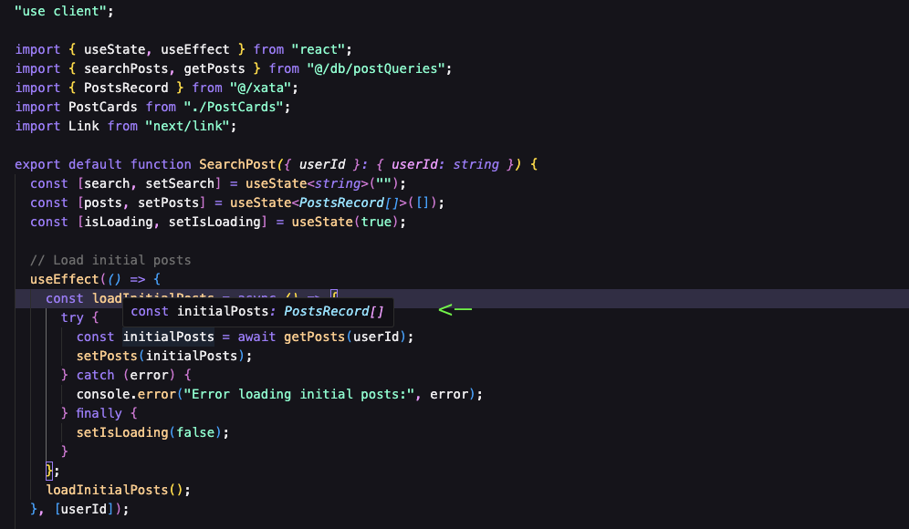

## Intro

It's been a while since I wrote an article and since I coded with Javascript. I was quiet busy with my new job at Amazon and being a father of three.
Maybe I'll explained more in details in another article why I moved away from Javascript. But to make it short I was playing with other programming languages like Python, Go and Rust. I've learnt so much from these languages, but at the end my love for the Javascript ecosystem is too strong.
So I decided to get up to date with the new version of Nextjs with the server component and server actions (and many other new features). As Go and Rust are strict-typed languages is has been easy to come back with Typescript.
So the main objective that I had was to understand how things work between server and client in the same project. I already dealt with it with Astro but it was using API endpoints. Here I wanted to avoid creating api routes.

## The stack choice

Here came the moment of choosing the stack to be able to practice the new aspect of Nextjs and learn from it. First of all I wanted a full-stack app, with authentication. The data didn't matter as there will be dummy anyway. I also wanted to not loose time in setting up complicated featrues as the goal was get familiar with Nextjs.
So I made these choices:

- [Clerk](https://clerk.com/) for authentication as it's quiet straight forward and fast to set up.
- [Xata](https://xata.io/) for the database as I really enjoy it in the past for its type safety and its fantastic SDK.

And here is the point of this article. How do the things work in this new version of Nextjs, for type safety between server and clien component?

## What I learn

It has been tricky to get used to use server action between server component and client one.
I was very confident about the fact that Xata generates automatically for you, the corresponding types from your database schema. As you can see below in a file called **xata.ts**, the type for my column 'posts' is defined.

Now it's time to create my server actions in a different file querying my database, like so:

I'm very confident here:

1. I import my types generated by Xata.
2. I checked the type in my function and it looks perfect.

Now let's see what we have in my client component that display the initial posts first and can also dynamically display the search result. For that I import my types from Xata and my server action:

But there is a problem here!!!! My initialPosts type is **any**

I was sure it was going to work, I imported the types, I define my posts state as PostRecord[]. Why is that not working?

Well is where some tools like [Zod](https://zod.dev/), come into place to valide the data from the client side to match what it's expected on the server.

But I was like kind of surprise why we would have some Xata type and we can not use them in the client. Well, I was obssesed to understand and wanted to try to make it work. So after some fails, I came with this:

- Add the return type of the actions (I know I was very stupid to not think about it before).

And the result in the client was:

## Conclusion

I don't know yet if I get it well and maybe I miss something, but in this situation I was sure that I had to use Zod, but with Xata things are much easier and even between client/server with server actions, you're confident about the data passed in your application.

I'm so happy to have been back into the Javascript ecosystem with these amazing tools like Xata and Nextjs that make things easier and scalable. There is still a lot of things to learn and implement (Suspense fallback with loading files, errors with error files, caching...), but I'm enjoying coding like that.

Please check out the Xata features (Serverless Postgress, Zero-downtime schema migrations, Branch system...), everything is made to make your developer experience even better. Thank to this amazing Team and its community.

You can find the demo [here](https://nextuserposts.netlify.app/)
and the code [here](https://github.com/Canfry/next-userposts)
